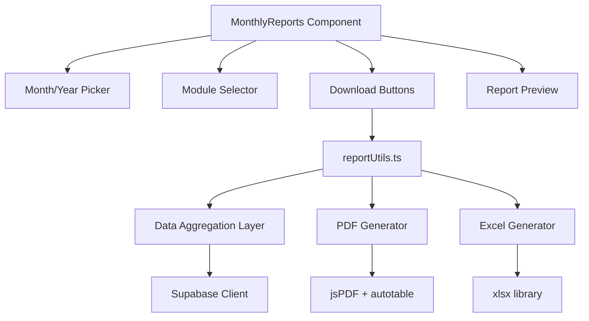

# Design Document: Monthly Reports Download

## Overview

The Monthly Reports Download feature adds a consolidated report generation system to MyLifeTracker. Users can select a month/year, pick which modules to include, and download a single PDF or Excel file summarizing their activity across Expenses, Debts, Jobs, Habits, Fitness, Routines, and Notes.

The feature builds on the existing `exportUtils.ts` patterns (jsPDF + jspdf-autotable for PDF, xlsx for Excel) and follows the app's established card-based UI with Tailwind CSS styling. It introduces a new `reports` tab in the navigation, a `MonthlyReports` component for the UI, and a `reportUtils.ts` module for data aggregation and export logic.

### Key Design Decisions

1. **New navigation tab** — Adding `reports` to the `TabId` union and Navbar keeps the feature accessible in one click, matching the existing navigation pattern.
2. **Separation of data aggregation from rendering** — A `reportUtils.ts` module handles all data fetching and aggregation, keeping the component thin and the logic testable.
3. **Reuse of existing export libraries** — jsPDF/autotable and xlsx are already dependencies; no new libraries needed.
4. **Client-side generation** — Reports are generated entirely in the browser from Supabase-fetched data, avoiding the need for a backend report service.

## Architecture



### Data Flow

1. User selects month/year and modules on the `MonthlyReports` page.
2. On download click, `reportUtils.ts` fetches data for the selected period from Supabase for each selected module.
3. The aggregation layer computes summaries (totals, breakdowns, rates) per module.
4. The PDF or Excel generator formats the aggregated data into the chosen output format.
5. The file is triggered for download via a Blob URL.

## Components and Interfaces

### New Files

| File | Purpose |
|------|---------|
| `src/components/reports/MonthlyReports.tsx` | Main UI component for the feature |
| `src/utils/reportUtils.ts` | Data aggregation and export logic |

### Modified Files

| File | Change |
|------|--------|
| `src/types/index.ts` | Add `'reports'` to `TabId` union |
| `src/components/Navbar.tsx` | Add Reports tab with `FileBarChart` icon |
| `src/App.tsx` | Add `MonthlyReports` route for `reports` tab |

### Component Interface

```typescript
// MonthlyReports.tsx - no props needed, fetches its own data
const MonthlyReports: React.FC = () => { ... }
```

### reportUtils.ts Public API

```typescript
interface ReportConfig {
  year: number;
  month: number; // 0-indexed (January = 0)
  modules: ModuleId[];
  currencySymbol: string;
}

type ModuleId = 'expenses' | 'debts' | 'jobs' | 'habits' | 'fitness' | 'routines' | 'notes';

interface ModuleSummary {
  moduleId: ModuleId;
  title: string;
  hasData: boolean;
  data: ExpenseSummary | DebtSummary | JobsSummary | HabitsSummary | FitnessSummary | RoutinesSummary | NotesSummary;
}

interface ReportData {
  period: string; // "January 2025"
  generatedAt: string;
  modules: ModuleSummary[];
}

// Core functions
function aggregateReportData(config: ReportConfig): Promise<ReportData>;
function generatePDF(reportData: ReportData, config: ReportConfig): void;
function generateExcel(reportData: ReportData, config: ReportConfig): void;
```

### Module Summary Interfaces

```typescript
interface ExpenseSummary {
  totalSpending: number;
  categoryBreakdown: { category: string; amount: number; percentage: number }[];
  top5Expenses: { description: string; amount: number; date: string; category: string }[];
}

interface DebtSummary {
  totalOutstanding: number;
  totalPaidThisMonth: number;
  debts: { source: string; paidAmount: number; remainingBalance: number }[];
}

interface JobsSummary {
  applicationsCount: number;
  statusBreakdown: { status: string; count: number }[];
  applications: { company: string; role: string; status: string }[];
}

interface HabitsSummary {
  overallCompletionRate: number;
  habits: { name: string; completions: number; target: number; rate: number }[];
  top3Consistent: { name: string; rate: number }[];
}

interface FitnessSummary {
  totalWorkouts: number;
  totalDuration: number;
  totalCalories: number;
  byType: { type: string; count: number; duration: number }[];
}

interface RoutinesSummary {
  totalCompletions: number;
  routines: { name: string; completions: number; target: number; rate: number }[];
  needsAttention: { name: string; rate: number }[];
}

interface NotesSummary {
  totalNotes: number;
  dates: string[];
}
```

## Data Models

### Supabase Queries by Module

Each module queries its respective Supabase table filtered by the selected month's date range (`startDate` to `endDate`):

| Module | Table | Filter Column | Additional Logic |
|--------|-------|---------------|------------------|
| Expenses | `expenses` | `date` | Group by category, sort by amount |
| Debts | `debts` + `debt_payments` | `debt_payments.month_key` | Sum payments for month, get current balances |
| Jobs | `job_applications` | `applied_date` | Group by status |
| Habits | `habits` + `habit_entries` | `habit_entries.date` | Calculate completion rates |
| Fitness | `workouts` | `date` | Sum duration/calories, group by type |
| Routines | `routines` + `routine_entries` | `routine_entries.date` | Calculate completion vs expected frequency |
| Notes | `notes` | `created_at` or `date` | Count and list dates |

### Date Range Calculation

```typescript
// For a given year/month (0-indexed), compute the inclusive date range
const startDate = `${year}-${String(month + 1).padStart(2, '0')}-01`;
const endDate = `${year}-${String(month + 1).padStart(2, '0')}-${daysInMonth}`;
```

### Settings Retrieval

Currency settings are read from localStorage (matching the existing pattern in `ExpenseTracker` and `DebtTracker`) to format monetary values in reports.


## Correctness Properties

*A property is a characteristic or behavior that should hold true across all valid executions of a system — essentially, a formal statement about what the system should do. Properties serve as the bridge between human-readable specifications and machine-verifiable correctness guarantees.*

### Property 1: Report contains exactly the selected modules

*For any* subset of modules selected by the user, the generated report data SHALL contain exactly one entry per selected module (with `hasData` set to true or false), and no entries for unselected modules. Additionally, the number of Excel worksheets SHALL equal the number of selected modules.

**Validates: Requirements 2.3, 11.2, 13.2**

### Property 2: Expense category breakdown is a valid partition of total spending

*For any* list of expenses in a report period, the sum of all category breakdown amounts SHALL equal the total spending, and the sum of all category percentages SHALL equal 100% (within floating-point tolerance). Every expense SHALL be accounted for in exactly one category.

**Validates: Requirements 3.1, 3.2**

### Property 3: Top-N selection returns the N largest items in descending order

*For any* list of items with a numeric value (expenses by amount, habits by completion rate), the top-N selection SHALL return items where every item's value is greater than or equal to any item not in the selection, and the items SHALL be sorted in descending order.

**Validates: Requirements 3.3, 6.3**

### Property 4: Debt summary preserves source data

*For any* set of debts and their payments for a month, the total outstanding SHALL equal the sum of all `current_balance` values, the total paid this month SHALL equal the sum of all payment amounts for that month, and each debt SHALL appear in the per-debt breakdown with its correct source, paid amount, and remaining balance.

**Validates: Requirements 4.1, 4.2, 4.3**

### Property 5: Job summary is a complete partition by status

*For any* set of job applications in a report period, the total application count SHALL equal the number of applications, the sum of all status breakdown counts SHALL equal the total count, and every application SHALL appear in the listed applications.

**Validates: Requirements 5.1, 5.2, 5.3**

### Property 6: Completion rate calculation is correct

*For any* set of habits (or routines) with their entries for a month, each item's completion rate SHALL equal its completed entry count divided by its target count for the month. The overall completion rate SHALL equal the total completions across all items divided by the total targets.

**Validates: Requirements 6.1, 6.2, 8.1, 8.2**

### Property 7: Fitness aggregation preserves totals

*For any* set of workouts in a report period, the total workout count SHALL equal the number of workouts, the total duration SHALL equal the sum of all `duration_min` values, the total calories SHALL equal the sum of all `calories_burned` values, and the sum of per-type counts SHALL equal the total workout count.

**Validates: Requirements 7.1, 7.2, 7.3**

### Property 8: Below-threshold filtering is correct

*For any* set of routines with computed completion rates, the "needs attention" list SHALL contain exactly those routines whose completion rate is below 50%, and SHALL NOT contain any routine with a rate of 50% or above.

**Validates: Requirements 8.3**

### Property 9: File naming follows the YYYY-MM pattern

*For any* valid year (2020–2099) and month (1–12), the generated filename SHALL match the pattern `monthly-report-YYYY-MM.pdf` or `monthly-report-YYYY-MM.xlsx` where YYYY is the 4-digit year and MM is the zero-padded month.

**Validates: Requirements 10.5, 11.4**

## Error Handling

| Scenario | Handling |
|----------|----------|
| Supabase query fails | Display a toast/alert with "Failed to generate report. Please try again." and log the error to console. Do not produce a partial file. |
| No data for selected month | Show an informational message on the UI. If download is triggered, include "No data" placeholders in each empty module section. |
| No modules selected | Disable download buttons, show inline message "Select at least one module." |
| PDF generation fails (jsPDF error) | Catch the error, show "PDF generation failed" message, do not trigger download. |
| Excel generation fails (xlsx error) | Catch the error, show "Excel generation failed" message, do not trigger download. |
| Very large data set (>1000 expenses) | Process in batches if needed; jsPDF autotable handles pagination automatically. No explicit limit imposed. |

## Testing Strategy

### Unit Tests (Example-Based)

Unit tests cover specific scenarios, edge cases, and UI behavior:

- Default month selection is current month
- All module checkboxes checked by default
- Download button disabled when no modules selected
- Empty state message when no data exists
- Currency symbol appears in monetary values
- PDF header contains app name, period, and date
- Each PDF section has a clear heading
- Excel worksheets have column headers
- Navigation tab exists and routes correctly

### Property-Based Tests

Property-based tests verify universal correctness properties using **fast-check** (TypeScript PBT library).

Configuration:
- Minimum 100 iterations per property test
- Each test tagged with: **Feature: monthly-reports-download, Property {N}: {title}**

Properties to implement:
1. Report module filtering (Property 1)
2. Expense partition validity (Property 2)
3. Top-N selection correctness (Property 3)
4. Debt aggregation correctness (Property 4)
5. Job summary completeness (Property 5)
6. Completion rate calculation (Property 6)
7. Fitness aggregation totals (Property 7)
8. Below-threshold filtering (Property 8)
9. File naming pattern (Property 9)

### Integration Tests

- End-to-end flow: select month → select modules → download PDF → verify file is produced
- Supabase data fetching with real (test) data for each module
- PDF and Excel file generation produces valid, non-empty files

### Test Library

- **fast-check** for property-based testing (already compatible with the Vite + TypeScript setup)
- **vitest** as the test runner (standard for Vite projects)
- **@testing-library/react** for component tests
